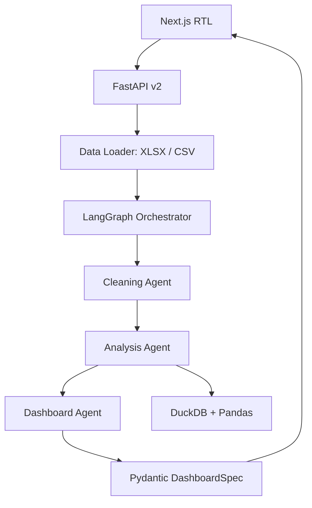

# معمارية بيّنة 2.0

## القرار المعماري

تستخدم «بيّنة» سيرًا متعدد الإيجنتات، لكن دون تفويض الحسابات للنموذج اللغوي. يفصل النظام بين:

1. بنية إدخال حتمية (`Data Loader`).
2. ثلاثة إيجنتات ذات مسؤوليات وعقود مستقلة.
3. طبقة حساب وتنفيذ حتمية عبر DuckDB وPandas.
4. عقد إخراج صارم (`DashboardSpec`) تتحقق منه Pydantic قبل وصوله إلى الواجهة.

هذا الفصل يجعل كل قرار قابلًا للتدقيق، ويمنع تضارب المسؤوليات أو تمرير رقم غير موثق.

## حدود المسؤوليات

| المكوّن | المسؤولية | ما لا يفعله |
|---|---|---|
| Data Loader | التحقق من XLSX/CSV وتوحيدهما إلى DataFrame | لا يتخذ قرارات تحليلية |
| Cleaning Agent | استدلال أدوار الأعمدة وقياس الجودة والغموض | لا ينشئ رسومًا أو أرقام أعمال |
| Analysis Agent | بناء خطة دلالية وتنفيذ التحليل والحسابات الموثقة | لا يعتمد على LLM كآلة حاسبة |
| Dashboard Agent | التحقق من المواصفة ومصدر كل ادعاء رقمي | لا يعيد حساب البيانات أو يتجاوز Pydantic |
| Question Agent | فهم سؤال المستخدم وبناء استعلام مقيد | لا ينفذ SQL حرًا ولا يتجاهل كيانًا غير معروف |

## Data Loader

- يدعم `.xlsx` بدون وحدات ماكرو و`.csv`.
- يتحقق من الامتداد وMIME وتوقيع XLSX والحجم والمسار.
- يكتشف فاصل CSV من مجموعة مقيدة: الفاصلة، الفاصلة المنقوطة، Tab، و`|`.
- يقبل UTF-8 وWindows-1256 للبيانات العربية.
- يطبق حدود الصفوف والأعمدة قبل إدخال البيانات إلى سير الإيجنتات.
- يعرض CSV كمجموعة بيانات ذات ورقة منطقية باسم `البيانات` حتى يبقى عقد الواجهة موحدًا.

## الحسابات المخصصة باللغة الطبيعية

المستخدم يستطيع كتابة مثال مثل:

`هامش الربح = الربح ÷ الإيرادات × 100`

تُحوّل العبارة إلى لغة حسابية صغيرة لا تسمح إلا بالأعمدة المعروفة والثوابت والعمليات `+ - × ÷`. لا يُستخدم `eval`، ولا تُقبل الدوال أو الاستدعاءات أو السمات أو كود Python. تجمع DuckDB الأعمدة أولًا، ثم يعيد Pandas الحساب بصورة مستقلة، ولا تعرض النتيجة إلا عند التطابق.

## الذاكرة والخصوصية

- الملف الخام مؤقت ويُحذف بعد انتهاء التحليل.
- تبقى نسخة DataFrame مؤقتة في ذاكرة عملية الخادم للأسئلة والحسابات المخصصة خلال الجلسة.
- النموذج اللغوي يستقبل أسماء الأعمدة وملخص الجودة فقط في التخطيط، ولا يستقبل صفوف الملف.
- جميع مدخلات أسماء الأعمدة تعامل كبيانات غير موثوقة.

## النشر

- الواجهة: Vercel أو أي مضيف يدعم Next.js 16.
- الخلفية: PythonAnywhere أو خدمة Python تدعم FastAPI/ASGI.
- لا يحتاج التحديث إلى قاعدة بيانات جديدة أو migration.
- لا يضاف أي dependency جديد عن القائمة الحالية؛ DuckDB وPandas موجودان أصلًا.

## مراجع تقنية

- [LangGraph overview](https://docs.langchain.com/oss/python/langgraph/overview)
- [Pydantic models](https://docs.pydantic.dev/latest/concepts/models/)
- [DuckDB Python API](https://duckdb.org/docs/stable/clients/python/overview)
- [Pandas read_csv](https://pandas.pydata.org/docs/reference/api/pandas.read_csv.html)