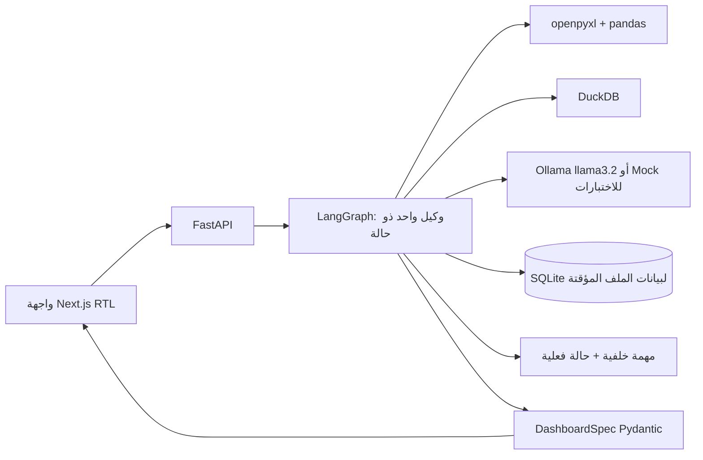

# المعمارية

## سبب الاختيار

اختير LangGraph لأنه يدير حالة طويلة متعددة المراحل مع conditional edges وcheckpoint وinterrupt/resume. استخدام LangChain وحده مناسب للاستدعاءات والأدوات لكنه لا يقدم هنا وضوح الرسم والحالة المتوقفة بنفس الصرامة. لم يُستخدم CrewAI لأن المشكلة تحتاج محللًا واحدًا وسياقًا موحدًا لا فريق وكلاء؛ تعدد الوكلاء يزيد التنسيق ولا يضيف قيمة حسابية.

## المكونات

- الواجهة تتحقق من JSON عبر Zod وتعرض مواصفة عامة؛ لا تولد صفحة برمجية لكل ملف.
- FastAPI يملك حدود الرفع ودورة التحليل.
- LangGraph هو منسق سير العمل الوحيد، وخطة Ollama المتحققة ترتب المقاييس والأبعاد واستراتيجيات الرسوم قبل التنفيذ.
- DuckDB وPython هما منفذا الحسابات الحتمية.
- Pydantic يمنع أي KPI أو رسم يشير إلى نتيجة غير مسجلة.
- تنفذ مهمة التحليل في الخلفية، وتعرض الواجهة المرحلة والنسبة من الحالة الفعلية للرسم.
- تُحذف نسخة XLSX وسجلها بعد اكتمال المهمة أو فشلها، ولا تُنشأ صفحة للملفات السابقة.