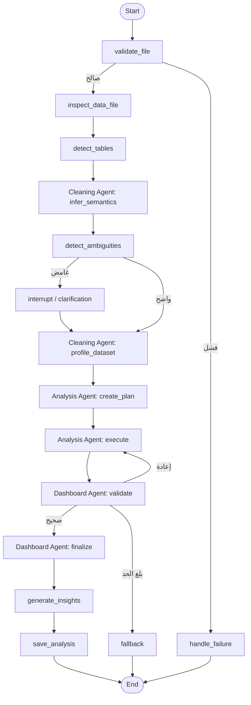

# سير LangGraph متعدد الإيجنتات

## سجل التنفيذ

الحالة تحمل `agent_runs` بالإضافة إلى `trace`. كل سجل إيجنت يحتوي الاسم، المسؤولية، الحالة، الملخص، والمخرجات التي أنتجها. يعرض الفرونت إند أحدث سجل مكتمل لكل إيجنت، بينما يبقى السجل الكامل متاحًا في استجابة API لأغراض التدقيق.

## الاستعادة والتحقق

- يستخدم `thread_id = analysis_id` مع `InMemorySaver`.
- يحفظ `interrupt()` الغموض الدلالي ويستأنف بـ`Command(resume=...)`.
- يعاد تنفيذ إيجنت التحليل عند فشل DashboardSpec أو التحقق الرقمي حتى الحد المحدد.
- بعد بلوغ الحد، يستخدم fallback محليًا محافظًا لا يعتمد على النموذج اللغوي.