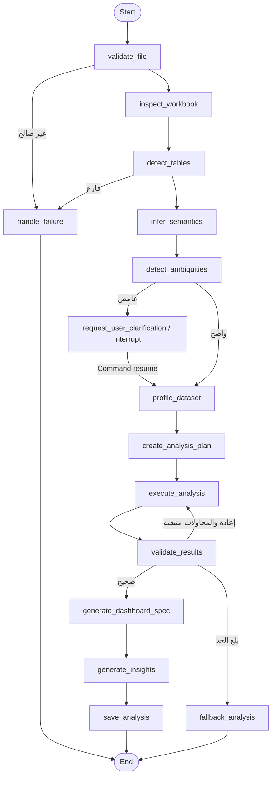

# سير LangGraph

الحالة TypedDict وتضم هوية الملف، الورقة، ملفات الأعمدة، الغموض، الربط، الجودة، الخطة، النتائج، DashboardSpec، المرحلة، التقدم، الأخطاء، عدد المحاولات، وسجل القرار. يستخدم InMemorySaver مع `thread_id=analysis_id`. عند الغموض تحفظ الحالة؛ تصبح قيمة `Command(resume=...)` جواب `interrupt()` عند إعادة دخول العقدة.

حلقة recovery تعيد `validate_results` إلى `execute_analysis`. الحد من 1 إلى 5، وبعده يعمل fallback محلي محافظ.

